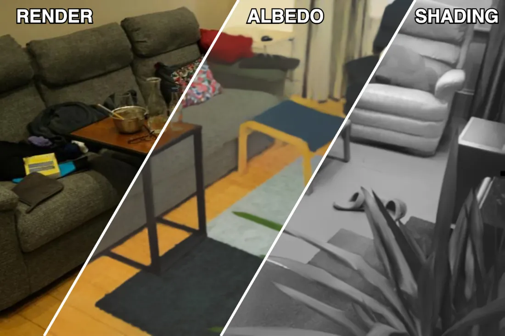

<h1 align="center">Intrinsic PAPR</h1>

<p align="center">
  <b>Tackling Misattribution in 3D Intrinsic Decomposition via Proximity Attention Point Rendering</b><br>
  ECCV 2026
</p>

<p align="center">
  <a href="https://amoazeni75.github.io/Intrinsic-PAPR/">Project page</a> &nbsp;·&nbsp;
  <a href="https://arxiv.org/abs/2407.00500">Paper</a>
</p>

<p align="center">
  
</p>

<p align="center">
  <i>View-consistent albedo and shading on real and synthetic scenes.</i>
</p>

Intrinsic PAPR builds on [PAPR](https://zvict.github.io/papr/) (Proximity Attention Point
Rendering) and splits its point-based renderer into an albedo branch and a shading branch, so
that each 3D primitive carries its own intrinsic properties. Because the split happens per
point, albedo and shading can be edited directly on the point cloud.

---

## Contents

- [1. Install](#1-install)
- [2. Data](#2-data)
- [3. The 2D prior](#3-the-2d-prior)
- [4. Train](#4-train)
- [5. Evaluate](#5-evaluate)
- [6. Editing](#6-editing)
- [7. Repository layout](#7-repository-layout)
- [8. Credits](#8-credits)

---

## 1. Install

```bash
conda env create -f environment.yml
conda activate intrinsic-papr
```

Data preparation additionally needs the Intrinsic decomposition pipeline:

```bash
pip install "git+https://github.com/compphoto/Intrinsic@main"
```

That pulls in `intrinsic`, `chrislib` and `altered_midas`. Check both halves with:

```bash
python -c "import torch, torchvision; print(torch.__version__, torch.cuda.is_available())"
python -c "import intrinsic, chrislib; print('extraction deps ok')"
```

Rendering new synthetic scenes with Blender uses a separate environment
(`conda env create -f blender.yml`).

The first training run downloads about 530 MB of pretrained weights (torchvision VGG16 for the
LPIPS loss), so the machine needs network access once. `vgg.pth` in this repository is only the
small LPIPS linear head.

Run all commands from the repository root.

## 2. Data

Three scene types are supported, selected by `scene_1.dataset.type`.

| `type` | Datasets | Layout expected |
|---|---|---|
| `synthetic` | NeRF Synthetic, TensoIR | `transforms_<split>.json`, `train/`, `test/` |
| `t2` | Tanks & Temples | `rgb/`, `pose/`, `intrinsics.txt` (NSVF layout) |
| `mip360` | Mip-NeRF 360 | `transforms.json`, `images_<factor>/` |

Download the sources from their own projects:
[NeRF Synthetic](https://github.com/bmild/nerf), [TensoIR](https://github.com/Haian-Jin/TensoIR),
[Tanks & Temples in NSVF layout](https://github.com/facebookresearch/NSVF#dataset),
[Mip-NeRF 360](https://jonbarron.info/mipnerf360/).

> **Tanks & Temples**: use the NSVF-preprocessed release, not the raw Tanks & Temples download.
> The loader needs per-image poses, and it splits train/val/test by the **first character of each
> filename** (`0` train, `1` val, `2` test), which is the NSVF convention.

The model does not read raw photographs directly. It trains against albedo and shading maps that
are extracted once, offline, and stored next to the images.

**Step 1 — synthetic scenes only: render the scene and its ground-truth albedo.**

```bash
conda activate blender
python tools/Blender_render_objects.py --help
```

**Step 2 — extract albedo and shading with the 2D prior.**

```bash
python tools/intrinsic_decomposition_using_prior_model.py \
  --prior_model yagiz_v1 \
  --dataset_type nerf_synthetic --dataset_root ./data/nerf_synthetic/lego
```

`--dataset_type` accepts `nerf_synthetic`, `tanks_temples` and `custom` (use `custom` for
Mip-NeRF 360 scenes, pointing `--dataset_root` at the resolution directory).

This writes, per scene, `<split>_albedo_<prior>/` and `<split>_shading_<prior>/`, plus a `_meta/`
directory holding `raw_statistics_eps_<eps>_<prior>.json`.

Two things have to line up, or training will not find its inputs:

- **The folder suffix must match the config.** The tool names its output after the prior, so
  `--prior_model yagiz_v1` produces `train_albedo_yagiz_v1/`. Set
  `scene_1.dataset.train_albedo_extraction_method` (and the `test_` twin) to `"_yagiz_v1"` to
  match. The shipped templates leave these empty, which points at a plain `train_albedo/`.
- **The statistics file is required.** Training reads it to map images into log space, and its
  epsilon must match `models.predict_in_log_space_eps` in the config (`1e-03` in the templates).

**Step 3 — Tanks & Temples only: normalise the layout.**

```bash
python tools/prepare_TT_for_albedo_extraction.py --root ./data/tanks_temples --scenes Truck
```

## 3. The 2D prior

`ambiguity_aware_prior/` holds the ambiguity-aware 2D intrinsic decomposition network. It is a
fork of Careaga and Aksoy's ordinal-shading network, extended with AdaIN style modulation and
trained with a cIMLE objective so that it produces several plausible albedo estimates per image
instead of one.

Two ways to produce the albedo and shading maps that training consumes:

```bash
# the public deterministic prior (no extra weights needed)
python tools/intrinsic_decomposition_using_prior_model.py \
  --prior_model yagiz_v1 --dataset_type nerf_synthetic --dataset_root ./data/nerf_synthetic/lego

# the ambiguity-aware prior, using weights you fine-tuned yourself
python tools/intrinsic_decomposition_using_prior_model.py \
  --prior_model cIMLE_yagiz_v1 --model_checkpoint <path to .pt> \
  --dataset_type nerf_synthetic --dataset_root ./data/nerf_synthetic/lego
```

The output directory carries the prior's name as a suffix, and the config field
`scene_1.dataset.train_albedo_extraction_method` selects which one training reads
(`""` for the plain `train_albedo/` folder, `"_cIMLE_yagiz_v1"` for the ambiguity-aware one).

### Multiple albedo estimates per view

The ambiguity-aware prior is generative: for one photograph it can produce several plausible
albedo maps. The space-carving loss uses that spread, so for the training split it needs **several
albedo samples per view**, not one.

Ask the prior for them with `--cIMLE_number_of_samples`:

```bash
python tools/intrinsic_decomposition_using_prior_model.py \
  --prior_model cIMLE_yagiz_v1 --model_checkpoint <path to .pt> \
  --cIMLE_number_of_samples 10 --cIMLE_d_latent 32 \
  --dataset_type nerf_synthetic --dataset_root ./data/nerf_synthetic/lego
```

Sample files are written next to the single-estimate ones, with the sample index appended to the
stem, e.g. `r_0_sample_0.npy` ... `r_0_sample_9.npy`. Only the training split gets samples; test
views keep one albedo, because the loss is a training-time term.

Then switch the loss on, and tell it how many samples to expect:

```yaml
scene_1:
  training:
    albedo_space_carving_loss:
      use: true
      num_samples: 10        # must match --cIMLE_number_of_samples
```

The number in the config and the number on disk must agree. The loader builds each view's albedo
tensor by reading `_sample_0` through `_sample_<num_samples-1>`, so a missing file is a
`FileNotFoundError` at startup. With `use: false` (the shipped default) the loader reads the plain
single albedo map and ignores any sample files.

See [ambiguity_aware_prior/README.md](ambiguity_aware_prior/README.md) to fine-tune the prior.

## 4. Train

Three config templates ship, one per scene type. Pick the scene on the command line rather than
editing the file:

```bash
python train.py --opt configs/synthetic.yml \
  --index Lego --scene_1.index lego \
  --dataset_root ./data/nerf_synthetic \
  --scene_1.dataset.path lego --scene_1.eval.dataset.path lego \
  --gpu_id 0
```

`configs/tanks_and_temples.yml` and `configs/mipnerf360.yml` work the same way. Every key in a
config becomes a `--key` flag, nested with dots, so anything can be overridden without editing
YAML.

Results land in `<save_dir>/<index>/<scene>/`: `checkpoints/`, `train_main_plots/`,
`train_pcd_plots/`, and `metrics.jsonl` with one JSON object of scalar metrics per logged step.

Pass `--log_gradient_stats` to add per-parameter gradient and value statistics to
`metrics.jsonl`. It is off by default because it walks every parameter at each eval step.

Unbounded Mip-NeRF 360 scenes turn on `geoms.background.append_bkg_points`, which gives every ray
one extra attention slot at its intersection with a large background sphere. Set
`sphere_center` and `sphere_radius` from the scene's COLMAP point cloud before training a new
scene.

## 5. Evaluate

Render the test views:

```bash
python test.py --opt configs/synthetic.yml \
  --index Lego --scene_1.index lego \
  --dataset_root ./data/nerf_synthetic \
  --scene_1.dataset.path lego --test_dataset_path lego \
  --scene_1.load_path checkpoints-250000.pth \
  --test_action render --render_frame_type all --media_type image \
  --save_albedo_images --save_image_with_numpy --gpu_id 0
```

That writes the predicted renders and albedo maps, together with the PSNR, SSIM and LPIPS printed
by `test.py` for novel-view synthesis.

For albedo metrics, note that the paper follows NeRFactor and GS-IR in applying a per-channel
scale alignment between prediction and ground truth before computing PSNR, SSIM and LPIPS; that
alignment has to be applied when comparing against the saved `test_albedo_GT` maps.

Albedo consistency across views (MACE) comes from
`--test_action calculate_albedo_consistency`, which writes `albedo_consistency.json` per run.

## 6. Editing

Because albedo and shading live on the points, an edit made in one view carries to every other
view. A region is given as a stroke file: a plain text list of pixel coordinates, one per line.

```bash
python test.py --opt configs/synthetic.yml ... \
  --test_action freefrom_transfer_albedo \
  --source_target_area_selection_method freeform_pixels \
  --source_area_path data/r_30_strokes_source.txt \
  --target_area_path data/r_30_strokes_target.txt
```

`data/` holds the stroke files used for the paper's figures, so those edits can be reproduced
directly. The full set of `--test_action` values is `render`, `transfer_albedo`,
`transfer_shading`, `freefrom_transfer_albedo`, `freefrom_transfer_shading`,
`change_brightness`, `interpolate_albedo`, `calculate_albedo_consistency`,
`2D_color_interpolation_with_UNet`, `TSNE`, `PCA` and `render_depth_pcd_for_comparison`.

The error metrics for a transfer are computed by `tools/calculate_transfer_losses.py`
(and `tools/calculate_transfer_losses_multi_samples.py` for the multi-sample case).

## 7. Repository layout

```
train.py / test.py          entry points
scene_manager.py            builds the dataset, model, losses and checkpoints
models/                     the point renderer: attention, MLPs, UNet decoders, LPIPS
dataset/                    loaders for synthetic, Tanks & Temples and Mip-NeRF 360
configs/                    one template per scene type
tools/                      data preparation, the 2D prior interface, transfer metrics
ambiguity_aware_prior/      the 2D intrinsic decomposition prior
data/                       stroke and region files for the editing experiments
```

This release carries only the code paths the shipped configs actually use. The research codebase
had many alternatives at each dispatch point — other UNet decoders, point-selection strategies,
positional-encoding schemes and activations — and those were removed rather than shipped dead. A
config value outside the documented set will raise `NotImplementedError` rather than silently
fall back.

## 8. Credits

This code builds on work by others, and keeps their files close to the originals:

- **PAPR**, Zhang et al. — the point renderer this work extends.
  https://github.com/zvict/papr
- **Colorful Diffuse Intrinsic Image Decomposition in the Wild** and the ordinal shading network,
  Careaga and Aksoy — the 2D prior in `ambiguity_aware_prior/` is a fork of their training code,
  and the extraction tools call their released pipeline. https://github.com/compphoto/Intrinsic
- **MiDaS**, Ranftl et al. — `ambiguity_aware_prior/models/midas_net_small.py`.
  https://github.com/isl-org/MiDaS
- **LPIPS**, Zhang et al. — `models/lpips.py`. https://github.com/richzhang/PerceptualSimilarity
- **U-Net**, Ronneberger et al., via SNP and Pytorch-UNet — `models/unet.py`.
  https://github.com/princeton-vl/SNP, https://github.com/milesial/Pytorch-UNet

## Citation

```bibtex
@inproceedings{moazeni2026intrinsicpapr,
  title     = {Intrinsic {PAPR}: Tackling Misattribution in 3D Intrinsic Decomposition
               via Proximity Attention Point Rendering},
  author    = {Moazeni, Alireza and Peng, Shichong and Zhang, Yanshu
               and Vashist, Chirag and Li, Ke},
  booktitle = {European Conference on Computer Vision ({ECCV})},
  year      = {2026}
}
```
